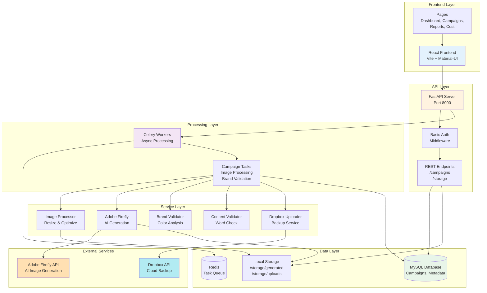
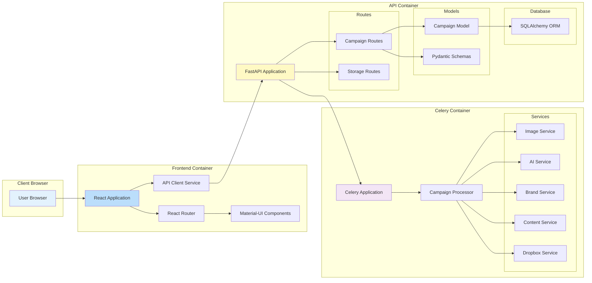
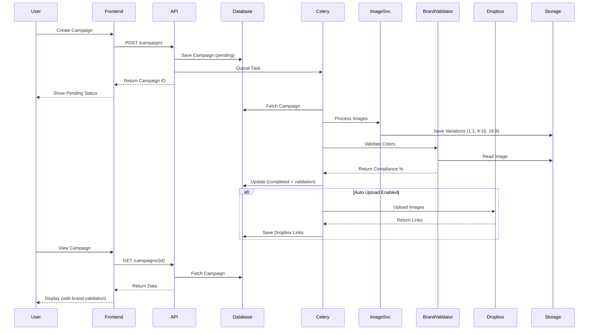
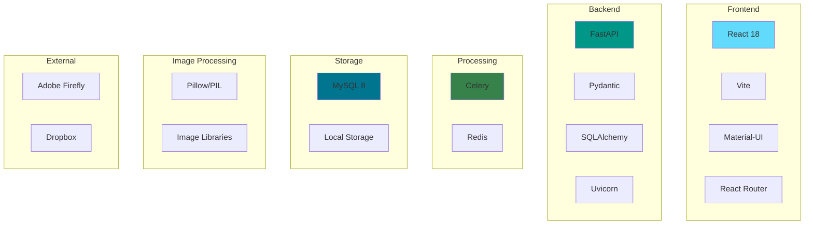

# System Architecture Diagram

## High-Level Architecture



## Detailed Component Architecture



## Data Flow Diagram



## System Components

```
┌─────────────────────────────────────────────────────────────────┐
│                         USER INTERFACE                          │
│  ┌──────────┬──────────┬──────────┬──────────┬──────────┐     │
│  │Dashboard │Campaigns │  Create  │ Reports  │   Cost   │     │
│  └──────────┴──────────┴──────────┴──────────┴──────────┘     │
│  ┌──────────────────────────────────────────────────────┐     │
│  │           React + Vite + Material-UI                 │     │
│  └──────────────────────────────────────────────────────┘     │
└─────────────────────────────────────────────────────────────────┘
                              ↓ HTTP/REST
┌─────────────────────────────────────────────────────────────────┐
│                         API LAYER                               │
│  ┌──────────────────────────────────────────────────────┐     │
│  │                  FastAPI Server                      │     │
│  │  ┌──────────┬──────────┬──────────┬──────────┐     │     │
│  │  │ Campaigns│ Storage  │  Auth    │ CORS     │     │     │
│  │  └──────────┴──────────┴──────────┴──────────┘     │     │
│  └──────────────────────────────────────────────────────┘     │
└─────────────────────────────────────────────────────────────────┘
          ↓                                      ↓
┌──────────────────┐                  ┌──────────────────┐
│   MySQL Database │                  │  Redis Queue     │
│                  │                  │                  │
│  ┌────────────┐  │                  │  ┌────────────┐ │
│  │ Campaigns  │  │                  │  │   Tasks    │ │
│  │ Products   │  │                  │  │   Queue    │ │
│  │ Metadata   │  │                  │  └────────────┘ │
│  └────────────┘  │                  └──────────────────┘
└──────────────────┘                           ↓
                                    ┌──────────────────────┐
                                    │   Celery Workers     │
                                    │                      │
                                    │  ┌───────────────┐  │
                                    │  │ Image Process │  │
                                    │  ├───────────────┤  │
                                    │  │ AI Generate   │  │
                                    │  ├───────────────┤  │
                                    │  │ Brand Validate│  │
                                    │  ├───────────────┤  │
                                    │  │ Content Check │  │
                                    │  └───────────────┘  │
                                    └──────────────────────┘
                                              ↓
                    ┌────────────────────────┼────────────────────────┐
                    ↓                        ↓                        ↓
          ┌──────────────┐        ┌──────────────┐        ┌──────────────┐
          │Local Storage │        │Adobe Firefly │        │   Dropbox    │
          │              │        │      API     │        │     API      │
          │ /generated/  │        │              │        │              │
          │ /uploads/    │        │ AI Images    │        │   Backup     │
          └──────────────┘        └──────────────┘        └──────────────┘
```

## Technology Stack



## Network Architecture

```
                    ┌─────────────────────┐
                    │   User's Browser    │
                    │   Port: 5173 (dev)  │
                    └──────────┬──────────┘
                               │ HTTP
                               ↓
                    ┌─────────────────────┐
                    │   Nginx Reverse     │
                    │   Proxy (Optional)  │
                    └──────────┬──────────┘
                               │
                ┌──────────────┼──────────────┐
                │              │              │
                ↓              ↓              ↓
    ┌───────────────┐  ┌──────────────┐  ┌──────────────┐
    │   Frontend    │  │   API Server │  │  File Server │
    │   Port: 5173  │  │   Port: 8000 │  │  /storage/*  │
    │   (Vite Dev)  │  │   (FastAPI)  │  │              │
    └───────────────┘  └──────┬───────┘  └──────────────┘
                              │
                    ┌─────────┼─────────┐
                    │         │         │
                    ↓         ↓         ↓
            ┌────────────┐ ┌───────┐ ┌──────────┐
            │   MySQL    │ │ Redis │ │  Celery  │
            │ Port: 3306 │ │ 6379  │ │ Workers  │
            └────────────┘ └───────┘ └──────────┘
                                            │
                          ┌─────────────────┼─────────────────┐
                          ↓                 ↓                 ↓
                    ┌──────────┐      ┌──────────┐    ┌──────────┐
                    │  Adobe   │      │ Dropbox  │    │  Local   │
                    │ Firefly  │      │   API    │    │ Storage  │
                    │   API    │      │          │    │          │
                    └──────────┘      └──────────┘    └──────────┘
```

## Deployment Architecture

```mermaid
graph TB
    subgraph "Docker Compose Environment"
        subgraph "Frontend Container"
            FE[React App<br/>Node + Vite<br/>Port: 5173]
        end
        
        subgraph "API Container"
            API[FastAPI App<br/>Python + Uvicorn<br/>Port: 8000]
        end
        
        subgraph "Celery Container"
            Worker[Celery Worker<br/>Python]
        end
        
        subgraph "Redis Container"
            Redis[Redis Server<br/>Port: 6379]
        end
        
        subgraph "MySQL Container"
            MySQL[MySQL 8<br/>Port: 3306]
        end
    end
    
    subgraph "Shared Volumes"
        Storage[/storage/<br/>Generated Images<br/>Uploads]
    end
    
    subgraph "External Network"
        Adobe[Adobe API]
        Dropbox[Dropbox API]
    end
    
    FE --> API
    API --> MySQL
    API --> Redis
    Worker --> Redis
    Worker --> MySQL
    Worker --> Storage
    API --> Storage
    
    Worker --> Adobe
    Worker --> Dropbox
    
    style FE fill:#e3f2fd
    style API fill:#fff3e0
    style Worker fill:#f3e5f5
    style Redis fill:#ffebee
    style MySQL fill:#e8f5e9
```

## Key Features by Component

### Frontend
- **Dashboard:** Campaign overview, statistics
- **Campaign Management:** Create, list, view details
- **Reports:** Asset reporting and analytics
- **Cost Management:** Cost tracking (mockup)
- **Navigation:** Sidebar, routing

### API Server
- **Authentication:** Basic Auth middleware
- **Campaign CRUD:** Create, Read, Update, Delete
- **File Serving:** Static file delivery
- **Validation:** Content and input validation
- **CORS:** Cross-origin support

### Background Workers
- **Image Processing:** Resize, optimize, format
- **AI Generation:** Adobe Firefly integration
- **Brand Validation:** Color compliance checking
- **Content Validation:** Prohibited word filtering
- **Dropbox Upload:** Automatic backup

### Data Storage
- **MySQL:** Campaign data, metadata, products
- **Redis:** Task queue, job management
- **File System:** Generated images, uploads

### External Integrations
- **Adobe Firefly:** AI image generation
- **Dropbox:** Cloud backup and sharing

## Data Models

```
Campaign
├── id (UUID)
├── description
├── target_market
├── campaign_message
├── products_description
├── marketing_channel
├── products (JSON)
│   └── [{sku, price}, ...]
├── item_metadata (JSON)
│   ├── campaign_type
│   └── brand_validation
│       ├── status
│       ├── message
│       └── details
│           ├── is_compliant
│           ├── compliance_percentage
│           ├── brand_color_matches
│           └── dominant_colors
├── image_metadata (JSON)
│   ├── source_type
│   ├── source_path
│   └── ai_prompt
├── processed_images (JSON)
│   ├── ratio_1_1
│   ├── ratio_9_16
│   └── ratio_16_9
├── dropbox_links (JSON)
│   ├── ratio_1_1 {path, link, size}
│   ├── ratio_9_16 {path, link, size}
│   └── ratio_16_9 {path, link, size}
├── status (enum)
├── content_validation_status
├── content_validation_message
└── timestamps
```

## Processing Pipeline

```
1. Campaign Creation
   ↓
2. Content Validation (prohibited words)
   ↓
3. Database Save (pending)
   ↓
4. Queue Background Task
   ↓
5. Image Processing
   ├── AI Generation (if enabled)
   ├── Image Resize (3 ratios)
   ├── Optimization
   └── Save to Storage
   ↓
6. Brand Validation
   ├── Extract Dominant Colors
   ├── Match Brand Colors
   ├── Calculate Compliance %
   └── Save Results
   ↓
7. Dropbox Upload (if enabled)
   ├── Upload All Variations
   ├── Create Shared Links
   └── Save Links
   ↓
8. Complete Campaign
   └── Update Status (completed)
```

## Security Architecture

```
┌──────────────────────────────────────┐
│         Security Layers              │
├──────────────────────────────────────┤
│ 1. Basic Authentication              │
│    - Username/Password               │
│    - All API endpoints protected     │
├──────────────────────────────────────┤
│ 2. Input Validation                  │
│    - Pydantic schemas                │
│    - Type checking                   │
│    - Field validation                │
├──────────────────────────────────────┤
│ 3. Content Validation                │
│    - Prohibited word filtering       │
│    - Business rule enforcement       │
├──────────────────────────────────────┤
│ 4. Path Security                     │
│    - Storage path validation         │
│    - Directory traversal prevention  │
├──────────────────────────────────────┤
│ 5. CORS Configuration                │
│    - Origin validation               │
│    - Method restrictions             │
├──────────────────────────────────────┤
│ 6. External API Security             │
│    - Token management                │
│    - Credential rotation             │
└──────────────────────────────────────┘
```

## Scaling Considerations

```
Current Architecture (Single Server)
┌──────────────────────────────────┐
│      Single Server/Container     │
│  ┌────────┬────────┬────────┐   │
│  │Frontend│  API   │ Celery │   │
│  └────────┴────────┴────────┘   │
│  ┌────────┬────────┐            │
│  │ MySQL  │ Redis  │            │
│  └────────┴────────┘            │
└──────────────────────────────────┘

Scaled Architecture (Future)
┌──────────────────────────────────┐
│       Load Balancer              │
└─────────────┬────────────────────┘
              │
    ┌─────────┼─────────┐
    ↓         ↓         ↓
┌─────┐   ┌─────┐   ┌─────┐
│API 1│   │API 2│   │API 3│
└─────┘   └─────┘   └─────┘
    ↓         ↓         ↓
┌─────────────────────────────┐
│    Shared Services          │
│  ┌────────┬─────────┐      │
│  │MySQL HA│ Redis HA│      │
│  └────────┴─────────┘      │
└─────────────────────────────┘
              │
    ┌─────────┼─────────┐
    ↓         ↓         ↓
┌────────┐ ┌────────┐ ┌────────┐
│Celery 1│ │Celery 2│ │Celery 3│
└────────┘ └────────┘ └────────┘
```

## File Organization

```
headless-content-delivery/
├── api/                    # Backend API
│   ├── main.py            # FastAPI application
│   ├── models.py          # Database models
│   ├── schemas.py         # Pydantic schemas
│   ├── database.py        # DB connection
│   └── auth.py            # Authentication
├── services/              # Business logic
│   ├── image_service.py   # Image processing
│   ├── adobe_firefly_service.py
│   ├── brand_validator.py # Brand validation
│   ├── content_validator.py
│   ├── dropbox_upload_service.py
│   ├── tasks.py           # Celery tasks
│   └── celery_app.py      # Celery config
├── front-end/             # React frontend
│   ├── src/
│   │   ├── pages/         # React pages
│   │   ├── components/    # React components
│   │   └── services/      # API client
│   ├── package.json
│   └── vite.config.js
├── storage/               # File storage
│   ├── generated/         # Processed images
│   └── uploads/           # Uploaded images
├── config.py              # Configuration
├── docker-compose.yml     # Docker setup
└── requirements.txt       # Python deps
```

## Summary

This architecture provides:

✅ **Separation of Concerns** - Frontend, API, Processing separated
✅ **Scalability** - Background workers can be scaled independently
✅ **Reliability** - Async processing with retry mechanisms
✅ **Flexibility** - Modular service architecture
✅ **Maintainability** - Clear component boundaries
✅ **Extensibility** - Easy to add new features/services

### Key Design Decisions

1. **Async Processing:** Long-running tasks don't block API
2. **Service Layer:** Business logic separated from API
3. **JSON Storage:** Flexible metadata without schema changes
4. **Multiple Ratios:** Generate 3 aspect ratios per campaign
5. **Validation Pipeline:** Content + Brand validation
6. **External Integrations:** Modular service pattern
7. **Docker Compose:** Easy local development and deployment

